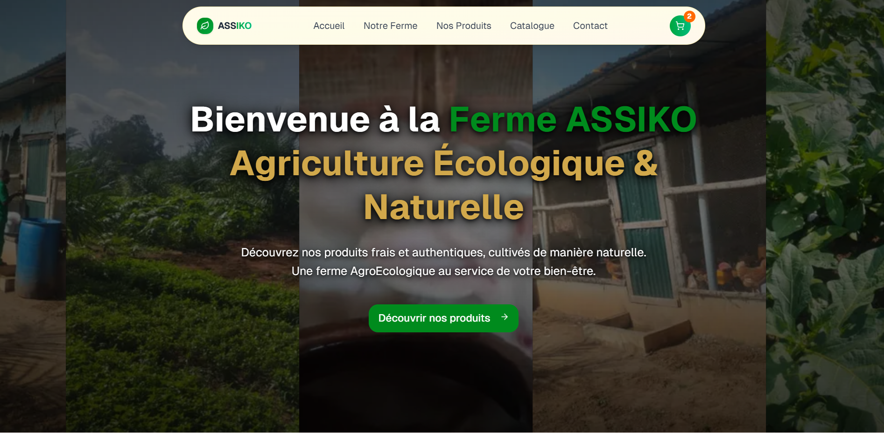

# Asssiko-farm - Modern Family farm

A modern e-commerce website for a family farm, built with Next.js 15, React 19, and TypeScript.

## Overview

This project is a complete website for a family farm selling local products. It includes all the necessary features for a smooth online shopping experience.

<p align = "center">

</p>

## Technologies Used

- **Framework**: Next.js 15.2.4
- **Frontend**: React 19
- **Language**: TypeScript
- **Styling**: Tailwind CSS with tailwindcss-animate and tw-animate-css
- **Forms**: react-hook-form with Zod validation
- **State Management**: React Contexts
- **Emails**: Resend

##  Project Structure

```
family-farm/
├── app/
│   ├── catalogue/
│   ├── checkout/
│   ├── contact/
│   ├── panier/
│   └── produit/[id]/
├── components/
│   ├── checkout/
│   ├── ui/
│   └── ...
├── lib/
│   ├── cart-context.tsx
│   ├── checkout-context.tsx
│   └── products-data.ts
├── emails/
└── public/
```
